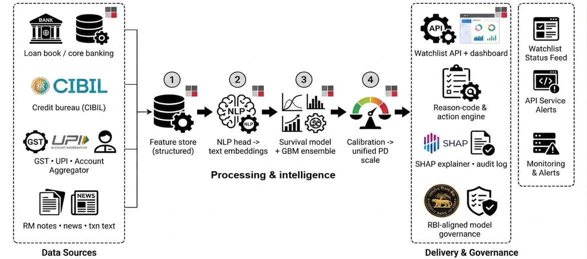
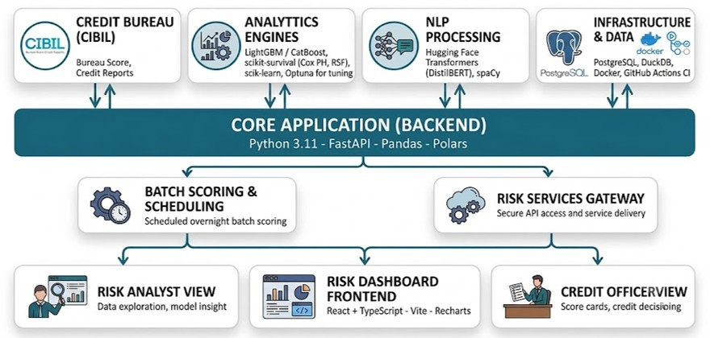

# PrakashPD — Default Prediction Model

Prototype for IDBI Innovate 2026, PS4: Default Prediction Model.

Predicts loan stress ahead of time on a single calibrated 0-100 scale, fusing
structured credit-bureau-style features with a simulated unstructured signal
(RM notes), with SHAP-based plain-language reason codes a credit officer can
act on — plus a what-if simulator to test restructuring terms and a one-click
action memo generator (JSON + PDF), so the score is something an officer can
act on, not just read.

## Architecture

The two diagrams below are the target/pitch-level architecture this
prototype is scoped down from. **They depict the full intended vision, not
everything in this repo** — see the callouts under each for what's actually
implemented here versus what's illustrative for the pitch.



*This prototype implements stages 1–4 of the pipeline above (feature store →
NLP head → survival + GBM ensemble → calibrated PD scale) and the reason-code
+ action engine and watchlist API/dashboard on the delivery side. It does
**not** implement live CIBIL/GST/UPI/Account-Aggregator data feeds, an
RBI-aligned governance layer, or production monitoring/alerting — those are
represented by synthetic data and a local FastAPI service instead (see
"What is real vs. what is simulated" below).*



*This prototype's actual stack is narrower than shown: Python 3.11 + FastAPI
+ pandas (no Polars), scikit-learn/LightGBM/lifelines (no Optuna tuning, no
scikit-survival), TF-IDF + SVD for the text signal (no Hugging Face
Transformers/DistilBERT/spaCy), and React + TypeScript + Vite for the
frontend (no Recharts — the PD gauge is a custom bar component per the
brief's "no circular dial" requirement). There is no CIBIL bureau
integration, PostgreSQL/DuckDB, Docker, or CI pipeline in this prototype —
data lives in CSV/artifact files on disk, which is appropriate for a
laptop-run hackathon demo but is exactly the kind of thing a production
build-out would add.*

## What is real vs. what is simulated

This is stated once here and is not repeated inline in every file — see the
notebook (`notebooks/01_eda_feature_engineering.ipynb`) for the exact point
each simulated field is introduced.

**Real:**
- The structured dataset — [UCI "Default of Credit Card Clients"](https://archive.ics.uci.edu/dataset/350/default+of+credit+card+clients),
  30,000 real Taiwanese credit-card accounts, Apr-Sep 2005, label = default
  in Oct 2005. Chosen over Home Credit / Lending Club / "Give Me Some Credit"
  because those require a Kaggle account + API token; this dataset is a
  direct, unauthenticated download, so the whole pipeline runs on a laptop
  with zero credentials.
- All EDA statistics and every feature engineered from the source columns
  (utilization ratios, payment ratios, delinquency counts/trend).
- The LightGBM classifier, the Cox PH survival model, the isotonic
  calibration, the TF-IDF+SVD NLP fusion, and the SHAP explainer — all
  genuinely trained/fitted, not stubbed.
- All reported metrics (AUC/Gini/KS/recall@20%) are computed on a held-out
  split, not fabricated.
- Every number the frontend displays comes from a live call to the FastAPI
  backend, which runs the saved model artifacts at request time — nothing
  in the UI is a hardcoded mock. This includes the "score a new loan" form
  and the what-if simulator: both call `model/inference.py`, the same
  generic scoring engine used for the watchlist, so a live score is a real
  re-run of the trained GBM + Cox + isotonic pipeline, never a lookup or a
  linear approximation.

**Simulated (and why):**
- **RM notes / narratives** — the source data has no free text at all. We
  generate template-based English notes whose sentiment is correlated with
  each borrower's *real* delinquency trend (not random), so the NLP fusion
  step has genuine signal to find rather than a decorative feature that does
  nothing.
- **`segment` and `exposure_at_risk`** — the source dataset is single-product
  (credit cards only), not a multi-segment loan book. We assign a synthetic
  segment label (skewed by real `LIMIT_BAL`) to demo the "one scale across
  segments" story from the brief. `exposure_at_risk` is derived from the real
  `LIMIT_BAL`/utilization fields, but the segment taxonomy itself is invented.
- **Survival `duration`/`event`** — the source label is a single one-month-
  ahead binary flag; there is no observed multi-month time-to-default. We
  derive a duration proxy from the real repayment-status trend (event =
  first month delinquency appears, censored at 6 months for non-defaulters)
  to demonstrate the survival-analysis *technique* the brief asks for. Treat
  the resulting "12-month horizon" framing as illustrative, not a validated
  forward time-to-default estimate.
- **`loan_vintage_month` / out-of-time split** — the source data has no date
  field whatsoever. We assign a synthetic vintage month and split on it
  (months 1-9 train, 10-12 test) to demonstrate a *time-based* validation
  methodology rather than a random split (which would overstate performance
  on a rare-event target). The metrics below come from that split, but it is
  not a real chronological backtest — there is no true time ordering in the
  underlying rows.

## Why not "accuracy"

The target is a ~22% base-rate rare event. A model that predicts "no
default" for every borrower scores ~78% accuracy while catching zero
defaulters — accuracy is actively misleading here. We report AUC, Gini
(`2*AUC - 1`), the KS statistic (max separation between the cumulative
good/bad distributions), and recall at the top 20% of the score
distribution (how many actual defaulters are captured if you only act on
the riskiest fifth of the book) instead.

## Real metrics achieved (out-of-time holdout, n=7,566)

| Metric | Value |
|---|---|
| AUC | 0.779 |
| Gini | 0.558 |
| KS statistic | 0.429 |
| Recall @ top 20% | 51.5% |
| Test default rate | 22.0% |
| Band split (test) | Watch 63.7% / Elevated 25.6% / High 10.7% |

These are consistent with published benchmarks on this dataset for
gradient-boosted models (~0.77-0.78 AUC); nothing here is inflated.

## The what-if simulator: real feature vs. translation layer

The brief asks that if a what-if lever "cannot plausibly be computed from the
model's input features," we say so rather than fake it. Exact breakdown:

- **Backed directly by trained features:** outstanding balance / principal
  (maps to `BILL_AMT1..6`, which feed `avg_util_ratio`) and repayment status
  history (`PAY_1..6`).
- **Backed by a disclosed translation layer, not a raw trained feature:**
  interest rate and tenure. This model is trained on revolving credit-card
  repayment history — there is no "interest rate" or "tenure" column in the
  training data at all (those are term-loan concepts). To make these levers
  do something real rather than skipping them, `model/inference.py:compute_emi`
  runs rate + tenure through the **standard reducing-balance EMI formula**
  (real, deterministic finance math) to derive a monthly payment, which is
  then written into the real trained `avg_pay_ratio` feature across the
  whole 6-cycle window — a restructure is a going-forward change, so it's
  applied to all 6 cycles, not just the most recent one (applying it to only
  one cycle was an early bug here: it diluted the effect roughly 1-in-6 and
  the what-if barely moved the score; fixed by applying the new terms across
  the full window). The GBM + Cox + isotonic pipeline is then genuinely
  re-run on this modified feature vector; only the rate/tenure→payment
  translation is a disclosed modeling choice, not literal training data.
- **What you'll observe:** the simulator can move a score *up* as well as
  down. If the EMI implied by a proposed rate/tenure is lower than what the
  borrower already pays, the model correctly reads that as a weaker
  repayment commitment and risk rises. That's intentional — proof this is a
  real model re-run, not a "sliders always help" gimmick.

## "Score a new loan": real vs. context-only fields

- **Real, trained features:** loan amount/credit limit, age, a 6-cycle
  repayment-history pattern selector, credit utilization %, existing/expected
  EMI, segment, and the free-text RM note.
- **Context-only, never fed to the model:** `tenure_months` and
  `annual_income`. Neither is a trained feature (see above); the form still
  collects them because an officer would want them on the memo, but the
  API/UI say explicitly that they don't affect the score rather than
  silently ignoring them.
- **A deeper limitation worth naming:** the model's strongest signals are
  repayment-*history* features that a genuinely first-time applicant
  wouldn't have yet. This is really a "behavior scorecard" (scores an
  existing/renewing relationship) rather than an "application scorecard" for
  a brand-new customer — the same distinction real bank risk stacks draw.
  "Score a new loan" is best read as scoring a proposed facility where the
  officer supplies an initial track record (or a neutral "clean" default).

## Repo structure

```
data/               download_data.py (no raw data committed)
notebooks/          01_eda_feature_engineering.ipynb — reproducible top to bottom
model/              train.py, explain.py, inference.py, artifacts/ (saved model + metrics report)
backend/            FastAPI service: watchlist, live scoring, what-if, memo generation (+ PDF template)
frontend/           React + TypeScript (Vite) risk console
```

## Setup and run

Requires Python 3.11+ and Node 18+.

### 1. Data + model training

```bash
cd model
pip install -r requirements.txt
pip install jupyter nbclient  # only needed to re-run the notebook
python ../data/download_data.py
jupyter nbconvert --to notebook --execute --inplace ../notebooks/01_eda_feature_engineering.ipynb
python train.py
```

This writes `model/artifacts/` (LightGBM model, Cox model, TF-IDF/SVD,
isotonic calibrator, config, metrics report, scored book).

### 2. Backend

```bash
cd backend
pip install -r requirements.txt
python -m uvicorn app.main:app --port 8000
```

Endpoints:
- `GET /api/summary` — book-level KPIs (total exposure, band counts)
- `GET /api/watchlist?segment=&band=&limit=&offset=` — ranked by exposure at risk
- `GET /api/loans/{borrower_id}` — PD, band, SHAP reason codes, recommended action
- `POST /api/score` — live scoring for a hypothetical new loan (see honesty note above)
- `POST /api/loans/{borrower_id}/what-if` — recompute PD under modified rate/tenure/principal/EMI
- `POST /api/loans/{borrower_id}/memo` — generate a structured action memo (JSON; also renders a PDF)
- `GET /api/memos/{memo_id}.pdf` — download the generated memo PDF
- `POST /api/rescore` — recomputes every score in the book live (the "overnight batch" trigger)

### 3. Frontend

```bash
cd frontend
npm install
npm run dev
```

Open the printed localhost URL. `frontend/.env` points at
`http://127.0.0.1:8000` by default. Five views: the watchlist, a per-loan
score detail page (bar-style PD gauge + reason codes + recommended action),
a "score a new loan" form (with one-click high-risk/low-risk example
buttons), a what-if panel and a "generate memo" button on the score detail
page.

## Modelling approach

1. **LightGBM** classifier on structured features (repayment history,
   utilization/payment ratios, delinquency trend) plus 8 TF-IDF→SVD
   components from the RM notes.
2. **Cox Proportional Hazards** (lifelines) on the same borrowers, giving a
   horizon-based hazard estimate instead of a single snapshot probability.
3. Both outputs are rank-normalized, blended (0.7 GBM / 0.3 Cox), and passed
   through an **isotonic regression** fit on the train split to produce one
   calibrated 0-100 score, banded into Watch / Elevated / High at the 70th
   / 90th percentile.
4. **SHAP** (`TreeExplainer`) on the LightGBM model generates the top 3-4
   feature contributions per loan, translated into plain-language reason
   codes (e.g. "3 of the last 6 billing cycles were delinquent" rather than
   a raw feature name). When an RM-note-derived feature is a top driver, the
   reason code quotes the actual note text rather than describing an
   uninterpretable embedding component.
5. **`model/inference.py`** is a single generic scoring engine — not a
   borrower-ID lookup — used by every caller (batch watchlist scoring, live
   "score a new loan", and the what-if simulator). It re-derives the same
   engineered features used at training time from a raw feature dict, so a
   live score is computed identically to how the historical book was scored.
   Train-set and test-set scores are rank-normalized against the same fixed
   *training* reference distribution (`np.searchsorted` against a saved
   sorted array) rather than each split's own distribution — this was a bug
   caught during development (the original evaluation ranked the test split
   against itself, which a deployed model could never do at serving time,
   and doesn't match how `score_full_book` scores in production); fixing it
   changed the reported AUC by <0.001, i.e. it wasn't inflating results, but
   it was methodologically wrong and is fixed in `model/train.py`.
6. **Action memo** (`backend/app/memo.py`): a deterministic, template-based
   plain-language summary (no LLM call, so no API key and fully
   reproducible) plus a PDF rendered with reportlab.

## Known limitations

- The survival and OOT-split components rely on simulated time structure
  (see above) because the source dataset has none — the "12-month horizon"
  framing is a technique demonstration, not a certified estimate.
- The Cox model horizon is capped at the observed 6-cycle window in the
  data; it does not extrapolate to a true calendar year.
- No hyperparameter tuning was performed beyond reasonable defaults — there
  is headroom in AUC with tuning, feature selection, and a real multi-loan-
  type dataset.
- Demographic fields (`SEX`, `EDUCATION`, `MARRIAGE`) are included as raw
  UCI columns for this prototype; a production deployment would need a
  fair-lending review before using any demographic feature in a credit
  decision.
- The what-if simulator's rate/tenure levers go through a disclosed EMI-
  formula translation layer, not literal trained features (see above) — real
  recomputation through the trained model, but rate/tenure are not columns
  the model was trained on directly.
- "Score a new loan" scores a proposed facility assuming an initial track
  record; it does not model a true zero-history first-time applicant, since
  the trained model's strongest signals are repayment-history features (see
  above).
- The memo's plain-language summary is deterministic template text, not an
  LLM-generated narrative — by design, so it needs no API key and is
  reproducible, but it reads more mechanically than a human-written memo.
